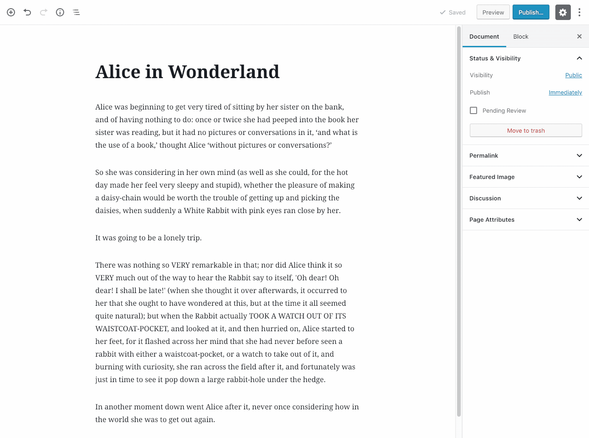

Fonts Plugin | Google Fonts Typography
===

Quickly and easily customize your website using Google Fonts.

The Google Fonts library currently contains 846 unique fonts. This plugin allows you to easily use any of them on your website.

You're not stuck with one font for the entire website, you can easily choose one font for headings and another for your content.

It's hard to know which font will look good on your website, that's why we've included a live preview feature. That means you can test each font and see a live preview of how it will look with your content instantly.

Once you've found a combination you love, press save and make the changes publicly visible.

The full Google Fonts library can be found here - https://fonts.google.com

The premium version of this plugin can be found here - https://fontsplugin.com

Getting Started
---------------

Upload 'Olympus Google Fonts', activate it, and you're done!

Navigate to wp-admin -> Appearance -> Customize and you will see a new tab named 'Google Fonts'

Gutenberg Block
---------------

Our new Gutenberg Block allows you to use Google Fonts within your content.

